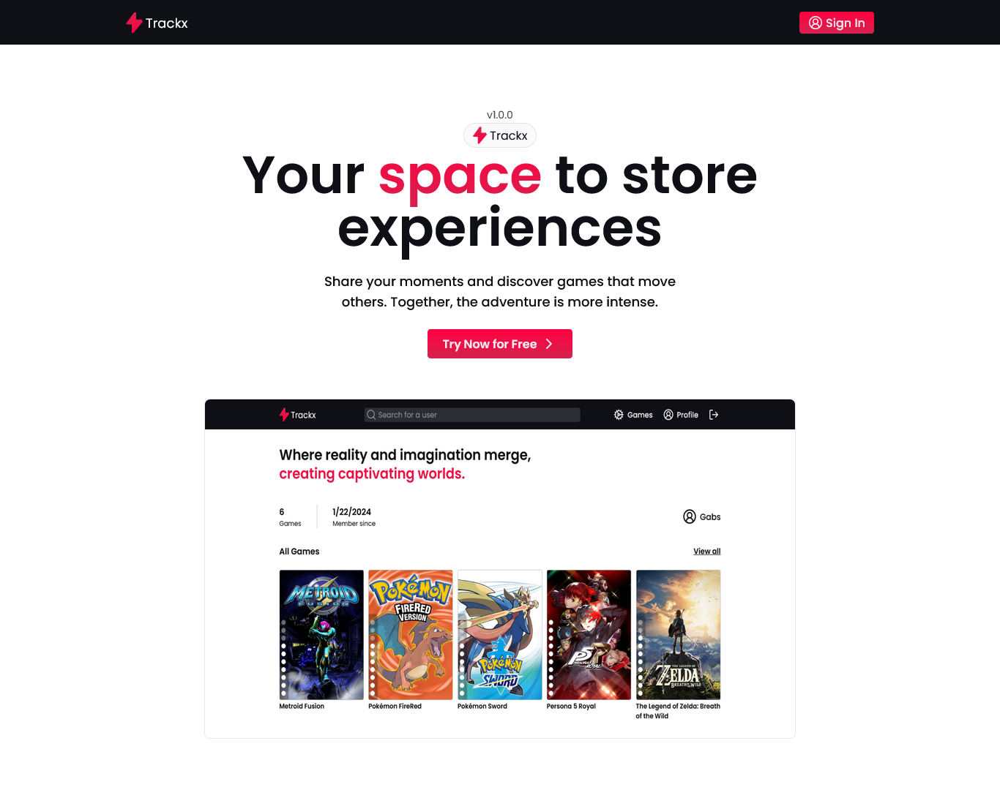

  

<h1 align="center">
 Trackx, Game Tracker
</h1>

The application is a game tracker built using React, Next.js, Node.js, and Nest.js. Users can register accounts and share information about the games they are currently playing or have played in the past. The platform allows users to rate and review the games they've experienced, creating a community-driven space for gaming enthusiasts. The integration of React and Next.js ensures a dynamic and responsive user interface, while the backend is powered by Node.js and Nest.js to handle user authentication, data storage, and API functionalities. This game tracker provides a comprehensive platform for gamers to connect, discover new titles, and share their gaming experiences with others.

### Data Validations:

The application incorporates a data validation mechanisms to ensure the integrity and accuracy of user-provided information. Utilizing validation libraries or custom validation functions, the system validates user input during account registration, game submissions, and any other data entry points. This helps prevent invalid or malicious data from compromising the application's functionality and security.

### Private Routes:

To enhance security and protect sensitive user information, the application employs private routes. Users must be authenticated and authorized to access certain pages or functionalities within the application. Through the use of authentication middleware, such as JWT (JSON Web Tokens), the system ensures that only authorized users can access their personal profiles, game submissions, and other restricted content.

### REST API:

The application follows the principles of REST (Representational State Transfer) architecture to facilitate seamless communication between the frontend and backend. RESTful APIs provide a standardized and scalable approach to handling data requests and responses. These APIs are structured to support CRUD (Create, Read, Update, Delete) operations, allowing users to interact with the system efficiently. Endpoints are designed to provide access to user data, game details, and other relevant information through HTTP methods, such as GET, POST, PUT, and DELETE.

Together, these elements contribute to a secure, efficient, and user-friendly game tracking application, ensuring that users can safely share their gaming experiences while maintaining the integrity of the data and adhering to proper authentication and authorization protocols.

Project made with :blue_heart: by <a href="https://github.com/stardusteight-d4c">Gabriel Sena</a>
